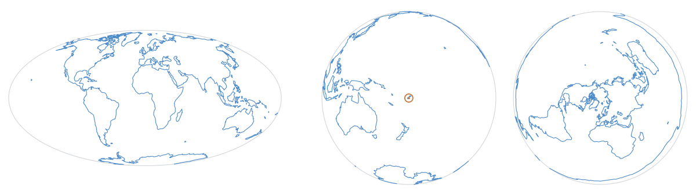

# coast-wright

**[One map, a dozen projections.][demo]** Pick one and watch the world
redraw.

[][demo]

Same coastline, same drawing call, fourteen projections — the [demo][demo]
prints the few lines of arithmetic that did change next to the map, and the
boat drags across the date line and over the pole without the map tearing.

> **Alpha.** The code is lifted from a shipping plugin and its tests came with
> it, but the format it reads is still settling. See
> [the spec's change policy](https://github.com/mark-brannan/portolani/blob/main/docs/portolano-format.md#8-changes).

Decode and draw [portolani][spec] — compact coastline geometry — onto a
canvas, through whatever projection you already have.

```js
import coastline from 'coastlines/coastline-110m' with { type: 'json' }
import { rings, limn } from 'coast-wright'

limn(ctx, rings(coastline), lon => /* → px */, lat => /* → py */, {
  color: '#8ab',
  lonCenter: 0,
})
```

No dependencies. No projection of its own. About 100 lines.

## Why it isn't a for-loop

Because of two things that are only obvious after they have gone wrong on a
screen at sea:

**The seam.** A ring crossing the antimeridian holds two points a tenth of a
degree apart on the ground and 360 apart in the numbers. Joined, they lay a
line straight across the map. So does a ring passing behind a window centred
anywhere but Greenwich — which is why `limn` tests each segment against
`lonCenter`, the longitude your projection measures from, rather than against
the dateline. A dateline-only guard looks correct until somebody centres the
map on their own boat. And a projection that does not wrap has a seam of its
own: a `visible` predicate lets it refuse the far hemisphere of a globe, or
the antipode an azimuthal chart divides by zero on, instead.

**The projection.** `limn` takes your `x` and `y` functions and assumes
nothing else. Equirectangular, azimuthal over a pole, a band around a vessel —
all the same call. The reason coastline data gets drawn by hand instead of
borrowed is usually that every library brought its own Web Mercator, and
Mercator cannot show a pole.

## API

### `rings(portolano)` → `[[lon, lat], …][]`

Every ring of a document, flattened across polygons. This is what you stroke.
Decoded once per document and cached — it is the same few thousand points on
every redraw, and a map redraws on resize.

### `polygons(portolano)` → `[[outer, …holes], …]`

A `polygons` portolano with its hole structure kept. This is what you fill.
Fill with the even-odd rule; the format does not specify winding order, so do
not infer holes from it.

### `limn(ctx, rings, x, y, options)`

Strokes rings onto a canvas 2D context. `x` and `y` each receive the other
coordinate as a second argument — `x(lon, lat)` and `y(lat, lon)` — because
outside the cylindrical family neither output is computable from one
coordinate alone. A function that ignores the second argument keeps working
unchanged.

| Option | Default | |
| --- | --- | --- |
| `color` | context's own | Stroke style. |
| `alpha` | `0.45` | Coastline under data wants to stay under it. |
| `width` | `1` | Line width in pixels. |
| `lonCenter` | `0` | The longitude your projection measures from. Get this right or the seam guard guards the wrong place. |
| `visible` | — | `(lon, lat) => bool`, for projections whose seam is not a wrap. A refused point lifts the pen and is never even projected — orthographic hides the far hemisphere, azimuthal equidistant masks the antipode its arithmetic divides by zero on. The wrap guard keeps running alongside. |

### `decodeRing(encoded, precision)` → `[[lon, lat], …]`

One encoded string. `precision` comes from the document's
`encoding.precision`; do not hard-code it, profiles differ.

`rings` and `polygons` refuse a document whose `format` or coordinate order
they do not recognise, rather than draw something wrong.

## Data

[`coastlines`][cl] ships ready-made profiles; [`portolani`][gen] generates
them, including regional extracts at pilotage scale. Neither is bundled here —
`coastlines` is an optional peer, so you choose the fidelity and pay for that.

## Licence

MIT.

[spec]: https://github.com/mark-brannan/portolani/blob/main/docs/portolano-format.md
[gen]: https://github.com/mark-brannan/portolani
[cl]: https://github.com/mark-brannan/coastlines
[demo]: https://mark-brannan.github.io/coast-wright/
