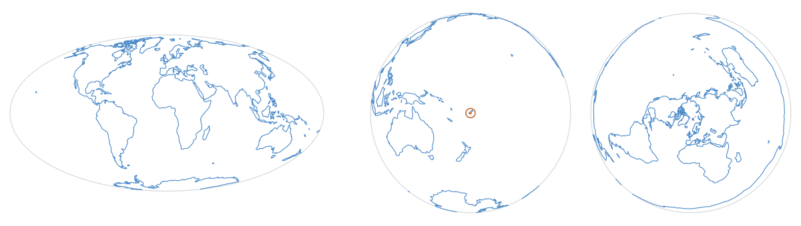

# coast-wright

**[One map, fourteen projections.][demo]** Pick one and watch the world
redraw.

[][demo]

Same coastline, same drawing call, fourteen projections. The [demo][demo]
prints the few lines of arithmetic that did change next to the map, and the
boat drags across the date line and over the pole without the map tearing.

> **Alpha.** Lifted from a shipping plugin, tests and all. The API may still
> move before 0.1.

Draw a coastline onto a canvas, through whatever projection you already have.
Hand it [Natural Earth][ne] GeoJSON as published and it draws every island as
is, with no decoder and no simplification in between.

```js
import { geojsonRings, limn } from 'coast-wright'

const coastline = await (await fetch('./ne_50m_coastline.geojson')).json()

limn(ctx, geojsonRings(coastline), lon => /* → px */, lat => /* → py */, {
  color: '#8ab',
  lonCenter: 0,
})
```

No dependencies. No projection of its own. A couple of hundred lines.

## Who is this for?

You are drawing a map on a canvas, in a browser or a [Signal K][sk] plugin,
and you already have a projection or want to choose one. You want the land
where it is, islands included, and no stray line slashed across the Pacific.

## The two things that go wrong at sea

Both look fine in a screenshot. Both fail on a boat.

**The seam.** Where a coastline crosses the date line, two neighbouring
points are a few miles apart on the water and 360 degrees apart in the
numbers. Join them and you get a line clean across the map. The same happens
wherever your map's edge falls, which is why `limn` wants `lonCenter`: the
longitude your projection measures from. A guard that only knows about the
date line looks right until somebody centres the map on their own boat. A
globe has a seam of a different shape, the far side, so `visible` lets your
projection refuse a point before it is drawn.

**The pole.** Most map libraries bring their own Web Mercator, and Mercator
cannot show a pole. `limn` brings nothing. It takes your `x` and `y`
functions and asks no questions, so an azimuthal chart over the pole, a band
around a vessel and a plain equirectangular grid are all the same call.

## API

### `geojsonRings(geojson)` → `[[lon, lat], …][]`

Every line and polygon ring in a GeoJSON document, as `[lon, lat]` pairs.
Takes a `FeatureCollection`, a `Feature` or a bare geometry; points are
skipped. This is what you hand to `limn`.

The result is cached per document, since a map redraws on every resize and a
full-detail coastline is tens of thousands of points. Treat it as read-only.
Anything that is not GeoJSON throws rather than drawing something wrong.

### `limn(ctx, rings, x, y, options)`

Strokes rings onto a canvas 2D context. On a globe or an azimuthal chart,
where a point lands on screen depends on both its coordinates, so each
function also receives the other one: `x(lon, lat)` and `y(lat, lon)`. A
function that ignores the second argument keeps working.

| Option | Default | |
| --- | --- | --- |
| `color` | context's own | Stroke style. |
| `alpha` | `0.45` | Coastline under data should stay under it. |
| `width` | `1` | Line width in pixels. |
| `lonCenter` | `0` | The longitude your projection measures from. Wrong, and the seam guard guards the wrong place. |
| `visible` | — | `(lon, lat) => bool`. Refused points lift the pen: a globe's far side, an azimuthal chart's antipode. |

### Portolano decoding, kept for now

The [portolano][spec] is a compact coastline format from an earlier design.
New work draws GeoJSON instead ([why][pm]); the decoder stays exported until
its retirement is decided, so existing callers keep working:

- `rings(portolano)` → every ring, flattened across polygons, cached per
  document.
- `polygons(portolano)` → `[[outer, …holes], …]`, holes kept. Fill even-odd;
  winding order is not promised.
- `decodeRing(encoded, precision)` → one ring; take `precision` from the
  document, profiles differ.

`rings` and `polygons` refuse a document whose `format` or coordinate order
they do not recognise.

## Data

[Natural Earth][ne] is public domain and publishes its coastline as GeoJSON
at three scales: about 140 KB, 1.6 MB and 10 MB for 110m, 50m and 10m,
a third of that gzipped. Nothing is bundled here. Pick the scale by timing
parse and draw on your own target, then pin the version and check the file's
hash at build.

```
https://raw.githubusercontent.com/nvkelso/natural-earth-vector/v5.1.2/geojson/ne_50m_coastline.geojson
```

Natural Earth asks for no credit. If you give one: *Made with Natural Earth.*

## Licence

MIT.

[ne]: https://www.naturalearthdata.com/
[sk]: https://signalk.org/
[spec]: https://github.com/mark-brannan/portolani/blob/main/docs/portolano-format.md
[pm]: https://github.com/mark-brannan/portolani/issues/25
[demo]: https://mark-brannan.github.io/coast-wright/
